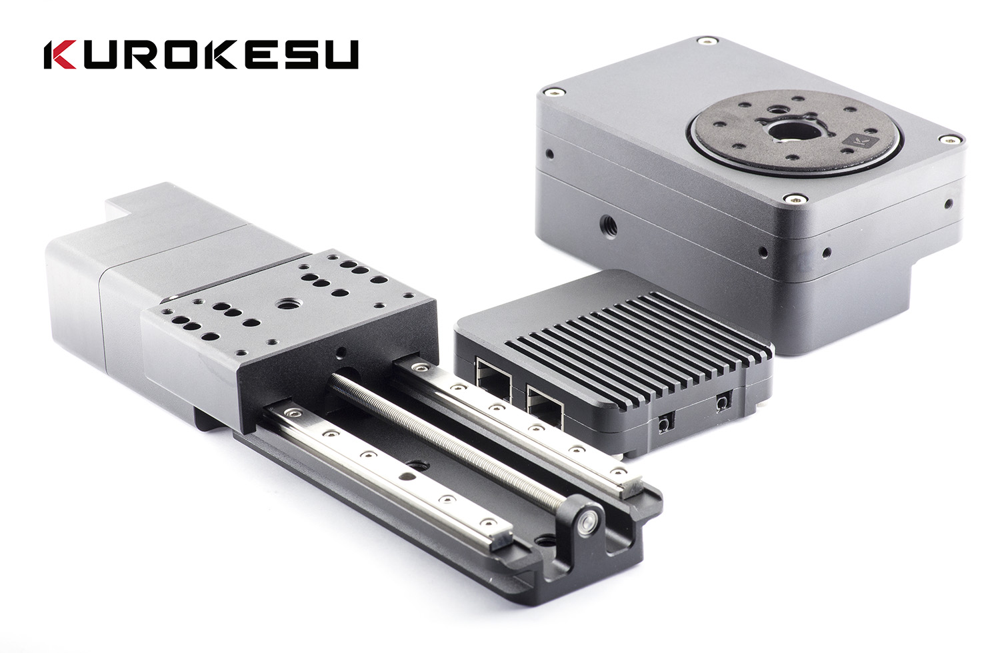

Commandline tool to control SCE2 controller. This is not very user friendly application, but it serves as base tool to automate some tasks and provide building blocks for custom application creation. Tyny footprint and lack of library overuse lets it to be used with bare minimal computers like Raspberry Pi (no modifications neede) or ESP32 (porting needed).

Primary use is designed for DOF stacking, but structure can be easily adapted to automate other processes.




### Useful links
* Controller: https://wiki.kurokesu.com/books/sce2
* Linear actuator: https://wiki.kurokesu.com/books/lsa1
* Rotary actuator: https://wiki.kurokesu.com/books/rsb1
* Ordeding: https://www.kurokesu.com/shop/motion_systems

### Running
After installing Python, run `pip: -r requirements.txt` command to install required packages. Then run each file one by one to perform different tasks.

### 01_prepare.py - enter driver and actuator parameters

This tool asks for many parameters about controller and attached actuator. These values are saved in `config.yaml` file and used by all other tools.

```
Enter hardware parameters.
Press ENTER if value should not be changed.

> Controller COM port [COM3]:
> Axis to be used [A]:

> Motion acceleration (mm/sec^2) [40.0]:
> Motion (steps per mm) [10078.74]:
> Max speed [250.0]:

> Actuator drive current (1-32) [31]:
> Actuator idle current (1-32) [10]:

> Pre shutter wait time [1.0]:
> Frames to capture [1]:
> Shutter hold time [0.5]:
> Post shutter hold time [0.5]:

> Rapid movement speed while taking pictures [250.0]:
> Normal movement speed while taking pictures [50.0]:
```

### 02_init.py - motor homing and reference point calibration

This tool sends configuration values to controller. Some of these values are stored in eeprom. Also moves actuator to home position.

```
 > $X ok
Controller version: [VER:1.1f-SCE2.20200929:]
 > $24=50 ok
 > $25=150 ok
 > $27=5 ok
 > $103=10078.74 ok
 > $123=40.0 ok
 > $113=250.0 ok
 > G100 P3 L144 N0 S0 F31 R10 ok

Moving fwd...
 > G91 ok

Waiting to stop...

Homing...
 > $HA ok

Moving back...
 > G0 A-7.5 ok

Waiting to stop...
```

### 03_manual_move.py - move actuator and provide keypoint positions for later use

This tool is used to move actuator with keyboard. Use A and S keys to move back/forward, 1 and 2 keys to set keypoints. Press Q to exit.

```
Manually adjust actuator

S - moves forward
A - moves backwards

1-9 - set keypoint value
SHIFT - makes motion slower

Q or ESC - exit tool

-0.314 mm
Keypoint 0 = -0.309
-0.305 mm
4.104 mm
Keypoint 1 = 4.269
4.269 mm
```

### 04_generate_gcode.py - Enter desired step count and generate g-code

This tool asks how many times to stop and generated g-code to be used with next tool.

```
Enter motion parameters.
Press ENTER if value should not be changed.
Preset points: 1 - start motion, 2 - end motion


** Keyponts from manual jogging
** Start: -0.309 mm
** End: 4.269 mm
** Distance to go: 4.578 mm
> Steps [10.0]: 5
** Step size: 0.9156000000000001 mm
```

### 05_drive.py - This tool moves actuator and operates camera shutter

This is straight forward g-code send application.

```
100%|███████████████████████████████████████████████████████████| 83/83 [00:15<00:00,  5.25it/s]
```
